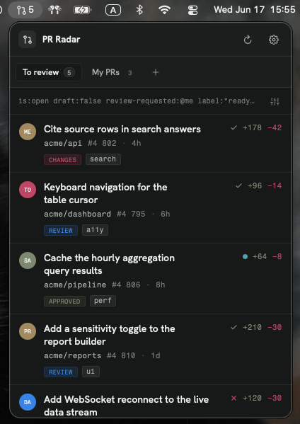
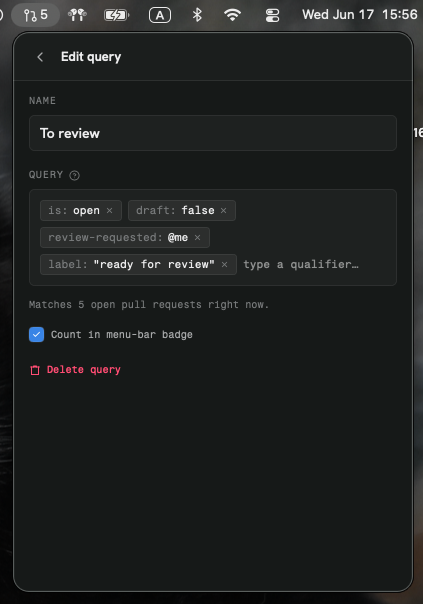

# PR Radar

A macOS menu-bar app that keeps the GitHub pull requests you care about one click
away — the ones waiting on your review and the ones you opened. Every tab is a
saved GitHub search; switching tabs re-filters the list live, and a badge on the
menu-bar icon counts the PRs in the queries you choose.

<p align="center">
  
  &nbsp;&nbsp;
  
</p>

## Features

- **Lives in the menu bar.** No dock icon, no window to manage. Click the
  git-pull-request mark to open a compact panel.
- **Saved queries as tabs.** Each tab is one GitHub search (e.g. *To review*,
  *My PRs*). Build them from qualifier chips — `is:open`, `review-requested:@me`,
  `draft:false`, `label:"ready for review"`, `repo:owner/name`, … — the same
  syntax you type in GitHub's search box.
- **Live match count.** The editor tells you how many open PRs a query matches as
  you add and remove qualifiers.
- **Menu-bar badge.** Opt any query into the badge; the icon shows the running
  total so you know when something needs you without opening anything.
- **At-a-glance rows.** Author avatar, repo, PR number, age, additions/deletions,
  CI status, review decision, and labels — per row.
- **Drag to reorder tabs**, light/dark aware, configurable refresh interval.
- **Auto-updates** via [Sparkle](https://sparkle-project.org).

## Requirements

- macOS 14 (Sonoma) or later.
- [GitHub CLI](https://cli.github.com) (`gh`) installed and authenticated —
  PR Radar uses it as its data layer. Authenticate once with:

  ```sh
  gh auth login
  ```

  The app finds `gh` in the usual locations (`/opt/homebrew/bin`,
  `/usr/local/bin`, …). If it's missing or logged out, the panel shows inline
  guidance.

## Install

1. Download the latest `PRRadar.zip` from the
   [Releases](https://github.com/iYasha/pr-radar/releases) page.
2. Unzip and move `PR Radar.app` to `/Applications`.
3. **First launch only:** right-click the app → **Open** (the build is ad-hoc
   signed, not notarized, so Gatekeeper asks once). Equivalent from the terminal:

   ```sh
   xattr -dr com.apple.quarantine "/Applications/PR Radar.app"
   ```

After that, Sparkle keeps it up to date automatically — every later version is
verified by EdDSA signature, so the right-click dance is a one-time thing.

## Usage

- Click the menu-bar icon to open the panel. It refreshes on launch, when the
  panel opens, on a background timer, and via the header refresh button.
- The two starter tabs — **To review** and **My PRs** — are ordinary saved
  queries: rename, edit, reorder, or delete them like any other.
- **`+`** adds a new tab. The sliders icon at the end of the query row opens the
  editor for the active tab, where you compose qualifiers as chips and toggle
  *Count in menu-bar badge*.
- The **gear** opens Settings: refresh interval (1 / 5 / 15 / 30 min), *Check for
  Updates*, and Quit.

State (your queries, the active tab, the refresh interval) is stored in
`~/Library/Application Support/PR Radar/state.json`.

## Build from source

Dev mode, for fast iteration:

```sh
swift build
swift run PRRadar          # or: .build/debug/PRRadar
```

A double-clickable, shareable `.app` bundle:

```sh
Scripts/build-app.sh       # → dist/PRRadar.app (release, ad-hoc signed)
open dist/PRRadar.app
```

The bundle is dockless (`LSUIElement`), embeds the fonts
(`ATSApplicationFontsPath`) and `Sparkle.framework`, carries the PR-glyph icon,
and is ad-hoc signed. See `Scripts/build-app.sh` for the configurable bits
(bundle id, version, minimum macOS, Sparkle feed and key).

## Releasing & auto-update

Installed copies poll an [appcast](appcast.xml) and self-update — no Developer ID
needed, because downloads are verified by EdDSA signature.

```sh
Scripts/release.sh 0.2.0   # build → zip → EdDSA-sign → gh release → appcast → push
```

That builds `dist/PRRadar.app` at the given version, zips and signs it with the
Sparkle EdDSA key (private key in the login keychain), publishes a GitHub release
with the zip asset, then regenerates and pushes `appcast.xml`. The app's
`SUFeedURL` points at the raw `appcast.xml`; `SUPublicEDKey` in the Info.plist
verifies downloads. Requires `gh` installed and authenticated.

## How it works

Each tab shells out to `gh api graphql` (`search(type: ISSUE)`), passing the
composed query as an opaque `-f q=` variable — one search call per tab. `is:pr`
is injected into every query. A saved query is just
`{ id, name, tokens: [String], countInBadge }`, and the search string is the
tokens joined by spaces.

For the domain language and the locked-in design decisions, see
[`CONTEXT.md`](CONTEXT.md) and [`docs/adr/`](docs/adr).

## License

[MIT](LICENSE) © 2026 iYasha
